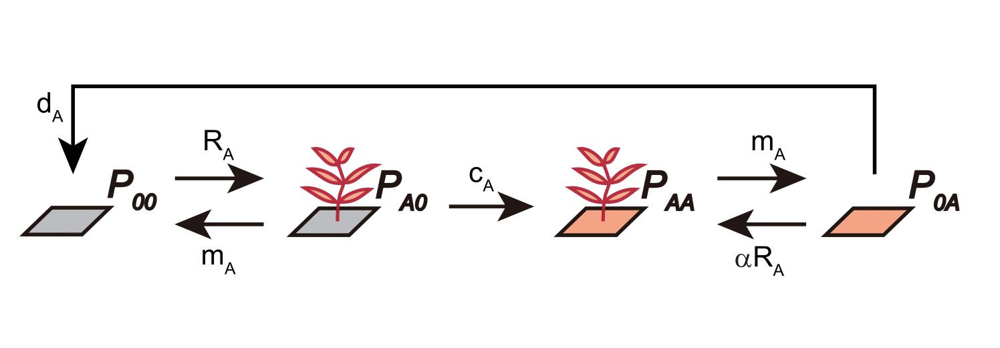

```{r setup, include = FALSE}
knitr::opts_chunk$set(message = F, 
                      error = F, 
                      warning = F)

```

# Week 6 {-} 
<div style = "font-size: 28pt"> **_Metapopulations and patch occupancy models_**</div>

## Lecture in a nutshell {-}

* **Topic:**
    1. 
    2. 
    3. 
    
<div style="height:1px ;"><br></div>

* **Topic:**
    1. 
    2. 
    3.

<div style="height:1px ;"><br></div>    
<br>


## Lab demonstration {-}



```{r, fig.width = 6, fig.height = 4, out.width = "70%", fig.align = "center"}
library(deSolve)
library(tidyverse)

### Model specification
plant_soil_model <- function(times, state, parms) {
  with(as.list(c(state, parms)), {
    dP00_dt = P0A*dA + PA0*mA - P00*(PA0 + PAA)*RA
    dPA0_dt = P00*(PA0 + PAA)*RA - PA0*mA - PA0*CA
    dPAA_dt = PA0*CA - PAA*mA + P0A*(PA0 + PAA)*RA*a
    dP0A_dt = PAA*mA - P0A*(PA0 + PAA)*RA*a - P0A*dA
    
    return(list(c(dP00_dt, dPA0_dt, dPAA_dt, dP0A_dt)))
  })
}

### Model parameters
times <- seq(0, 20, by = 0.1)
state <- c(P00 = 0.25, PA0 = 0.25, PAA = 0.25, P0A = 0.25)
parms <- c(RA = 0.5, mA = 0.1, CA = 0.5, dA = 0.4, a = 0.7)

### ODE solver
patch_prop <- ode(func = plant_soil_model, times = times, y = state, parms = parms)

### Visualization
patch_prop %>%
  as.data.frame() %>%
  pivot_longer(cols = -time, names_to = "patch", values_to = "prop") %>%
  ggplot(aes(x = time, y = prop, color = fct_reorder(patch, prop, last,  .desc = T))) + 
  geom_line(size = 1.5) +
  theme_classic(base_size = 12) +
  labs(x = "Time", y = "Proportion") +
  scale_x_continuous(limits = c(0, 20.5), expand = c(0, 0)) +
  scale_y_continuous(limits = c(0, 0.8), expand = c(0, 0)) +
  scale_color_brewer(name = NULL, palette = "Set1")    

```
<br>

## Additional readings {-}

[Otto & Day Chapter 2 - How to Construct a Model](./Additional readings/Otto_&_Day_Chapter2.pdf){target="_blank"}

<br>

## Assignments {-}

No assignments this week.


