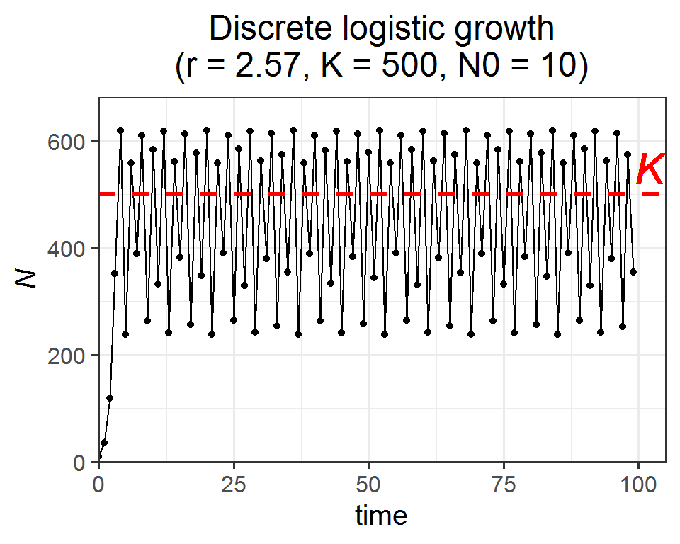
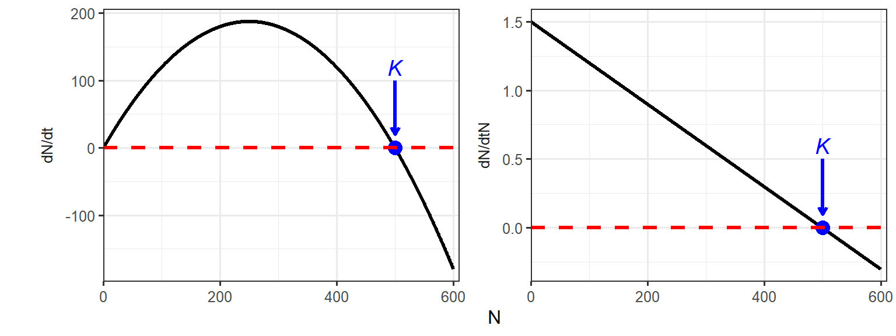

# Week 4 {-} 
<div style = "font-size: 28pt"> **_Density-dependence and logistic population growth_**</div>

## Lecture in a nutshell {-}

<br>
<br>
<br>
<br>
<br>

## Lab demonstration {-}

In this lab, we will solve the differential equation for logistic population growth and visualize how the population sizes change over time. Have a quick review of the [lab section][#week2lab] in Week 2.

We will also take a look at how population growth rate ($\frac{dN}{dt}$) and per capita growth rate ($\frac{dN}{dtN}$) change with population size ($N$). 

<br>

**Part 1 - Solving the logistic growth equation and visualize the results**


```r
library(tidyverse)
library(deSolve)

### Model specification
logistic_model <- function(times, state, parms) {
  with(as.list(c(state, parms)), {
    dN_dt = r*N*(K-N)/K  # logistic growth equation
    return(list(c(dN_dt)))  # return the results  
  })
}

### Model application
times <- seq(0, 10, by = 0.1)  # time steps to integrate over
state <- c(N = 10)  # initial population size
parms <- c(r = 1.5, K = 500)  # intrinsic growth rate and carrying capacity

# run the ode solver
pop_size <- ode(func = logistic_model, times = times, y = state, parms = parms)

### Visualize the results
ggplot(data = as.data.frame(pop_size), aes(x = time, y = N)) + 
  geom_point() + 
  labs(title = paste0("Logistic Growth \n (r = ", parms["r"], ", K = ", parms["K"], ")")) +
  theme_classic(base_size = 12) + 
  theme(plot.title = element_text(hjust = 0.5)) +
  scale_x_continuous(limits = c(0, 10.5), expand = c(0, 0)) +
  scale_y_continuous(limits = c(0, max(as.data.frame(pop_size)$N)*1.1), expand = c(0, 0))
```


<br>

Here is an interactive web app for the logistic growth model. Feel free to play around with the parameters/values and see how the population trajectories change.

<!-- <iframe src ="https://genchanghsu0115.shinyapps.io/Logistic_mod_shinyapp/" height = 450px width = 800px /> -->

<iframe src="https://genchanghsu0115.shinyapps.io/Logistic_mod_shinyapp/?showcase=0" width="800px" height="450px" data-external="1"></iframe>

<br>

**Part 2 - The relationship between population growth rate ($\frac{dN}{dt}$)/per capita growth rate ($\frac{dN}{dtN}$) and population size ($N$)**


```r
# parameters
r <- 1.5
K <- 500

# a vector of population sizes
N <- 0:600

# calculate the population growth rates and per capita growth rates
dN_dt <- r*N*(K-N)/K 
dN_dtN <- r*(K-N)/K

# organize into a dataframe
logistic_data <- data.frame(N, dN_dt, dN_dtN) %>%
  pivot_longer(cols = c(dN_dt, dN_dtN), 
               names_to = "vars", 
               values_to = "values")

# plot 
K_df <- data.frame(xend = c(500, 500),
                   yend = c(20, 0.1),
                   xstart = c(500, 500),
                   ystart = c(100, 0.5),
                   labels = c("italic(K)", "italic(K)"),
                   vars = c("dN_dt", "dN_dtN"))

ggplot(data = logistic_data, aes(x = N, y = values)) + 
  geom_line(size = 1.2) + 
  geom_point(x = 500, y = 0, size = 4, color = "blue") +
  geom_hline(yintercept = 0, linetype = "dashed", color = "red", size = 1.2) +
  labs(x = "N", y = "") +
  facet_wrap(~vars, 
             ncol = 2, 
             scales = "free_y",
             strip.position = "left", 
             labeller = as_labeller(c(dN_dt = "dN/dt", 
                                      dN_dtN = "dN/dtN"))) + 
  theme_bw(base_size = 12) +
  theme(strip.background = element_blank(),
        strip.placement = "outside",
        legend.position = "top",
        legend.title = element_blank()) + 
  scale_x_continuous(limits = c(0, 610), expand = c(0, 0)) + 
  geom_segment(data = K_df, 
               aes(x = xstart, y = ystart, xend = xend, yend = yend), 
               arrow = arrow(length = unit(0.03, "npc")), 
               size = 1.2,
               color = "blue") + 
  geom_text(data = K_df, 
            aes(x = xstart, y = ystart*1.2, label = labels),
            size = 5, 
            color = "blue",
            parse = T)
```




http://raven.wrrb.uaf.edu/~ntakebay/teaching/programming/logistic/node1.html

http://equation-of-the-month.blogspot.com/2012/01/logistic-growth.html

## Additional readings {-}

<br>
<br>

## Assignments {-}


