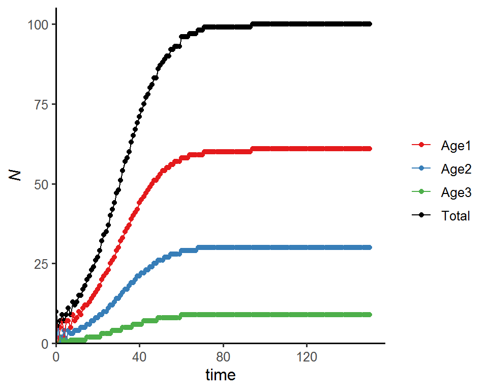
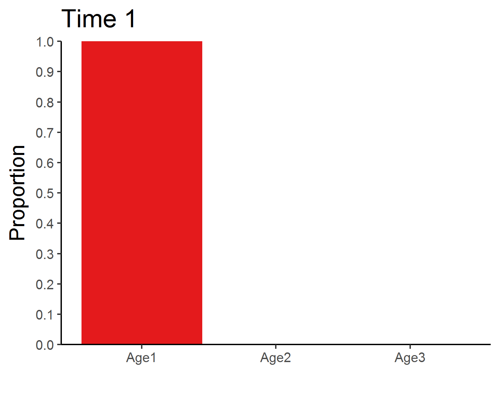

# Week 5 {-} 
<div style = "font-size: 28pt"> **_Age-structured models_**</div>

## Lecture in a nutshell {-}

<br>
<br>
<br>
<br>
<br>

## Lab demonstration {-}

In this lab, we will be analyzing a simple Leslie matrix using for loops + matrix algebra, comparing what we get with the results obtained via eigenanalysis, and visualizing the population dynamics (total population size and age distribution).

**Part 1 - Analyzing Leslie matrix**


```r
library(tidyverse)

### Leslie matrix and initial age classes
leslie_mtrx <- matrix(data = c(0, 0, 10,
                               0.6, 0, 0,
                               0, 0.3, 0.1),
                      nrow = 3, 
                      ncol = 3,
                      byrow = T)

initial_age <- c(20, 0, 0)

### for loop and matrix algebra
time <- 150
pop_size <- data.frame(Age1 = numeric(time+1),
                       Age2 = numeric(time+1),
                       Age3 = numeric(time+1))
pop_size[1, ] <- initial_age

for (i in 1:time) {
  pop_size[i+1, ] <- leslie_mtrx %*% as.matrix(t(pop_size[i, ]))
}

pop_size <- pop_size %>% 
  round() %>%
  mutate(Total_N = rowSums(.), 
         Time = 0:time) %>%
  relocate(Time)

head(round(pop_size)) 
```

```
##   Time Age1 Age2 Age3 Total_N
## 1    0   20    0    0      20
## 2    1    0   12    0      12
## 3    2    0    0    4       4
## 4    3   36    0    0      36
## 5    4    4   22    0      26
## 6    5    0    2    6       8
```

```r
### Asymptotic growth rate and stable age distribution 
asymptotic_growth <- round(pop_size[time+1, 4]/pop_size[time, 4], 3)
asymptotic_growth
```

```
## [1] 1.256
```

```r
age_distribution <- round(pop_size[time+1, 2:4]/sum(pop_size[time+1, 2:4]), 3)
age_distribution
```

```
##      Age1 Age2  Age3
## 151 0.622  0.3 0.078
```

```r
### Eigenanalysis of the Leslie matrix
eigen_out <- eigen(leslie_mtrx)
as.numeric(eigen_out$values[1]) %>% round(., 3)  # dominant eigenvalue
```

```
## [1] 1.251
```

```r
as.numeric(eigen_out$vectors[, 1]/sum(eigen_out$vectors[, 1])) %>% 
  round(., 3)  # stable age distribution
```

```
## [1] 0.623 0.299 0.078
```

The asymptotic growth rate and stable age distribution are pretty much the same for both for loops and eigenanalysis.

<br>

**Part 2 - Visualizing population dynamics**


```r
### Total population size
ggplot(data = pop_size, aes(x = Time, y = Total_N)) + 
  geom_point() + 
  geom_line() + 
  labs(x = "time", y = expression(italic(N))) +
  theme_classic(base_size = 12) +
  scale_x_continuous(limits = c(0, time*1.05), expand = c(0, 0)) +
  scale_y_continuous(limits = c(0, max(pop_size$Total_N)*1.05), expand = c(0, 0))
```


```r
### Stable age distribution
library(gganimate)

age_animate <- pop_size %>% 
  mutate(across(Age1:Age3, function(x){x/Total_N})) %>%
  select(Time, Age1:Age3) %>%
  pivot_longer(Age1:Age3, names_to = "Age", values_to = "Proportion") %>%
  ggplot(aes(x = Age, y = Proportion, fill = Age)) + 
  geom_bar(stat = "identity", show.legend = F) +
  labs(x = "") +
  scale_y_continuous(limits = c(0, 1), breaks = seq(0, 1, 0.1), expand = c(0, 0)) +
  scale_fill_brewer(palette = "Set1") + 
  theme_classic(base_size = 12) + 
  transition_manual(Time) + 
  ggtitle("Time {frame}") + 
  theme(title = element_text(size = 15))

anim_save("age_distribution.gif", age_animate, nframes = time + 1, fps = 4, width = 5, height = 4, units = "in", res = 300)
```

<style>
.center {
  display: block;
  margin-left: auto;
  margin-right: auto;
  width: 70%;
}
</style>


<br>

**Part 3 - Advanced topic: Incorporating density-dependence into Leslie matrix **

The cell values in a standard Leslie matrix are fixed and independent of population density, leading to an exponential population growth. This assumption can be relaxed by incorporating density-dependence into the transitions (survival probability, fecundity). Here, we will include negative density-dependence for the fecundity of individuals in Age3 class and see how this might affect the long-term population dynamics.


```r
### Leslie matrix, initial age classes, and carrying capacity
leslie_mtrx <- matrix(data = c(0, 0, 10,
                               0.6, 0, 0,
                               0, 0.3, 0.1),
                      nrow = 3, 
                      ncol = 3,
                      byrow = T)

initial_age <- c(20, 0, 0)
K <- 10000

### for loop and matrix algebra
time <- 150
pop_size_dens_dep <- data.frame(Age1 = numeric(time+1),
                                Age2 = numeric(time+1),
                                Age3 = numeric(time+1))
pop_size_dens_dep[1, ] <- initial_age

for (i in 1:time) {
  N <- sum(pop_size_dens_dep[i, ])  # the current population size
  leslie_mtrx_dens_dep <- leslie_mtrx
  
  # negative density-dependence for the fecundity of individuals in Age3 class
  ifelse((1-N/K) > 0,  
         leslie_mtrx_dens_dep[1, 3] <- leslie_mtrx_dens_dep[1, 3]*(1-N/K),
         leslie_mtrx_dens_dep[1, 3] <- 0)   
  
  pop_size_dens_dep[i+1, ] <- leslie_mtrx_dens_dep %*% as.matrix(t(pop_size_dens_dep[i, ]))
}

pop_size_dens_dep <- pop_size_dens_dep %>% 
  round() %>%
  mutate(Total_N = rowSums(.), 
         Time = 0:time) %>%
  relocate(Time)

head(round(pop_size_dens_dep)) 
```

```
##   Time Age1 Age2 Age3 Total_N
## 1    0   20    0    0      20
## 2    1    0   12    0      12
## 3    2    0    0    4       4
## 4    3   36    0    0      36
## 5    4    4   22    0      26
## 6    5    0    2    6       8
```

```r
### Age distribution
age_distribution_dens_dep <- round(pop_size_dens_dep[time+1, 2:4]/sum(pop_size_dens_dep[time+1, 2:4]), 3)
age_distribution_dens_dep
```

```
##      Age1 Age2  Age3
## 151 0.982    0 0.018
```

```r
### Total population size
ggplot(data = pop_size_dens_dep, aes(x = Time, y = Total_N)) + 
  geom_point() + 
  geom_line() + 
  labs(x = "time", y = expression(italic(N))) +
  theme_classic(base_size = 12) +
  scale_x_continuous(limits = c(0, time*1.05), expand = c(0, 0)) +
  scale_y_continuous(limits = c(0, max(pop_size_dens_dep$Total_N)*1.05), expand = c(0, 0))
```



```r
### Stable age distribution
age_animate_dens_dep <- pop_size_dens_dep %>% 
  mutate(across(Age1:Age3, function(x){x/Total_N})) %>%
  select(Time, Age1:Age3) %>%
  pivot_longer(Age1:Age3, names_to = "Age", values_to = "Proportion") %>%
  ggplot(aes(x = Age, y = Proportion, fill = Age)) + 
  geom_bar(stat = "identity", show.legend = F) +
  labs(x = "") +
  scale_y_continuous(limits = c(0, 1), breaks = seq(0, 1, 0.1), expand = c(0, 0)) +
  scale_fill_brewer(palette = "Set1") + 
  theme_classic(base_size = 12) + 
  transition_manual(Time) + 
  ggtitle("Time {frame}") + 
  theme(title = element_text(size = 15))

anim_save("age_distribution_dens_dep.gif", age_animate_dens_dep, nframes = time + 1, fps = 4, width = 5, height = 4, units = "in", res = 300)
```



## Additional readings {-}

<br>
<br>
<br>
<br>
<br>

## Assignments {-}

[](./Assignments/.pdf){target="_blank"}

<!-- [Suggested Solutions](./Assignments/.pdf){target="_blank"} -->


