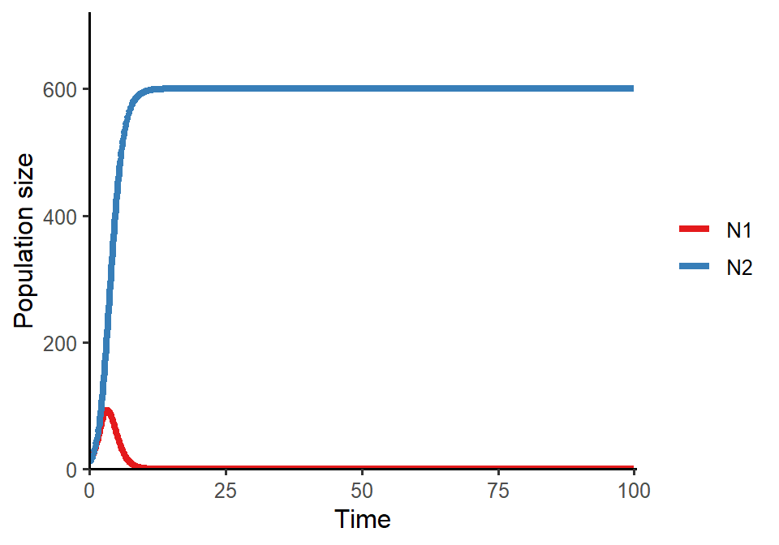

# Week 7  {-} 
<div style = "font-size: 28pt"> **_Lotka-Volterra model of competition: graphical analysis_**</div>

## Lecture in a nutshell {-}

* **Topic:**
    1. 
    2. 
    3. 
    
<div style="height:1px ;"><br></div>

* **Topic:**
    1. 
    2. 
    3.

<div style="height:1px ;"><br></div>    
<br>


## Lab demonstration {-}

In this lab, we are going to analyze the two-species Lotka-Volterra competition model and visualize the population dynamics under different parameter settings.


```r
library(tidyverse)
library(deSolve)

LV_pop_dynamics <- function(r1 = 1.4, r2 = 1.2, a11 = 1/200, a21 = 1/400, a22 = 1/200, a12 = 1/300) {
    
### Model specification
LV_competition_model <- function(times, state, parms) {
  with(as.list(c(state, parms)), {
    dN1_dt = N1*(r1-a11*N1-a12*N2)  
    dN2_dt = N2*(r2-a22*N2-a21*N1)
    return(list(c(dN1_dt, dN2_dt)))
  })
}

### Model parameters
times <- seq(0, 100, by = 0.1)
state <- c(N1 = 10, N2 = 10)
parms <- c(r1 = r1, r2 = r2, a11 = a11, a21 = a21, a22 = a22, a12 = a12)

### Model application
pop_size <- ode(func = LV_competition_model, times = times, y = state, parms = parms)

### Visualize the population dynamics
pop_size %>%
  as.data.frame() %>%
  pivot_longer(cols = -time, names_to = "species", values_to = "N") %>%
  ggplot(aes(x = time, y = N, color = species)) + 
  geom_line(size = 1.5) +
  theme_classic(base_size = 12) +
  labs(x = "Time", y = "Population size") +
  scale_x_continuous(limits = c(0, 100.5), expand = c(0, 0)) +
  scale_y_continuous(limits = c(0, max(pop_size)*1.2), expand = c(0, 0)) +
  scale_color_brewer(name = NULL, palette = "Set1")
}

### Different parameter settings
LV_pop_dynamics(r1 = 1.4, r2 = 1.2, a11 = 1/200, a21 = 1/400, a22 = 1/200, a12 = 1/300)  # stable coexistence
```


```r
LV_pop_dynamics(r1 = 1.2, r2 = 1.2, a11 = 1/200, a21 = 1/100, a22 = 1/100, a12 = 1/300)  # N1 wins
```


```r
LV_pop_dynamics(r1 = 1.2, r2 = 1.2, a11 = 1/200, a21 = 1/500, a22 = 1/500, a12 = 1/300)  # N2 wins
```


<br>

Here is the phase plane of the system in which the two species exhibit stable coexistence:


```r
### Parameters
r1 <- 1.4
r2 <- 1.2
a11 <- 1/200 
a21 <- 1/400
a22 <- 1/200 
a12 <- 1/300

### Vectors
LV_competition_model <- function(times, state, parms) {
  with(as.list(c(state, parms)), {
    dN1_dt = N1*(r1-a11*N1-a12*N2)  
    dN2_dt = N2*(r2-a22*N2-a21*N1)
    return(list(c(dN1_dt, dN2_dt)))
  })
}

times <- seq(0, 0.1, by = 0.1)
parms <- c(r1 = r1, r2 = r2, a11 = a11, a21 = a21, a22 = a22, a12 = a12)

vector_grid <- expand.grid(seq(5, 505, 20), seq(5, 505, 20))
vector_data <- vector_grid %>% 
  pmap(., function(Var1, Var2){
    state <- c(N1 = Var1, N2 = Var2)
    pop_size <- ode(func = LV_competition_model, times = times, y = state, parms = parms)
    pop_size[2, 2:3]
  }) %>% 
  bind_rows() %>%
  rename(xend = N1, yend = N2) %>%
  bind_cols(vector_grid) %>%
  rename(x = Var1, y = Var2)

### Phase plane
ggplot() + 
  geom_abline(slope = -a11/a12, intercept = r1/a12, color = "#E41A1C", size = 1.5) + 
  geom_abline(slope = -a21/a22, intercept = r2/a22, color = "#377EB8", size = 1.5) + 
  geom_segment(data = vector_data, 
               aes(x = x, y = y, xend = xend, yend = yend), 
               arrow = arrow(length = unit(0.1, "cm"))) +
  geom_point(aes(x = (a22*r1-a12*r2)/(a11*a22-a12*a21), 
             y = (a21*r1-a11*r2)/(a12*a21-a11*a22)), 
             color = "red", 
             size = 4) +
  scale_x_continuous(name = "N1", limits = c(0, 505), expand = c(0, 0)) +
  scale_y_continuous(name = "N2", limits = c(0, 505), expand = c(0, 0)) +
  theme_bw(base_size = 13) + 
  theme(panel.grid = element_blank()) 
```


<br>

## Additional readings {-}

<br>
<br>
<br>
<br>
<br>

## Assignments {-}

[Graphical Analysis of Lotka-Volterra Competition Model](./Assignments/Week7_LV Competition Model.pdf){target="_blank"}


