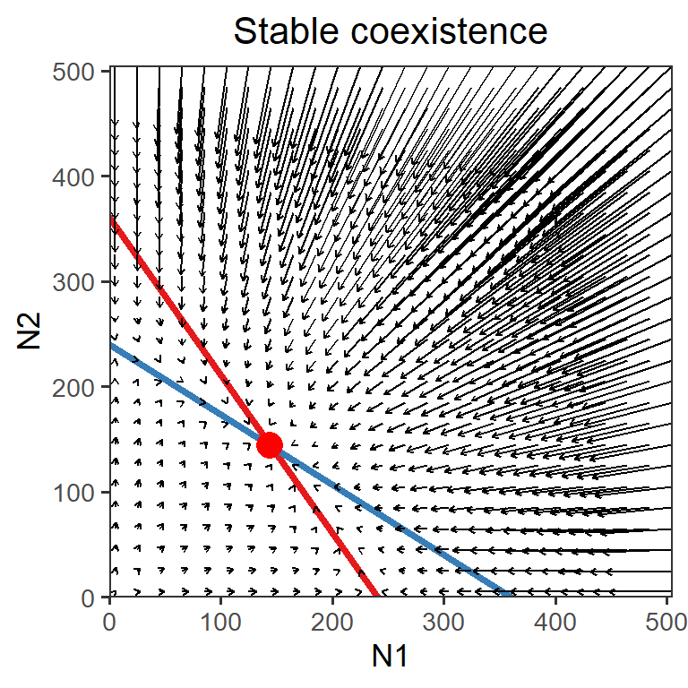

# Week 7  {-} 
<div style = "font-size: 28pt"> **_Lotka-Volterra model of competition: graphical analysis_**</div>

## Lecture in a nutshell {-}

* **Topic:**
    1. 
    2. 
    3. 
    
<div style="height:1px ;"><br></div>

* **Topic:**
    1. 
    2. 
    3.

<div style="height:1px ;"><br></div>    
<br>


## Lab demonstration {-}

In this lab, we are going to analyze the two-species Lotka-Volterra competition model numerically and visualize the population dynamics under different parameter settings.


<br>

Here are the phase planes of the systems in which (1) two species exhibit stable coexistence and (2) two species exhibit unstable coexistence (saddle point).


```r
phase_plane <- function(r1, r2, a11, a21, a22, a12, title, shape){
  ### Vectors
  LV_competition_model <- function(times, state, parms) {
    with(as.list(c(state, parms)), {
      dN1_dt = N1*(r1-a11*N1-a12*N2)  
      dN2_dt = N2*(r2-a22*N2-a21*N1)
      return(list(c(dN1_dt, dN2_dt)))
    })
  }
  
  times <- seq(0, 0.1, by = 0.1)
  parms <- c(r1 = r1, r2 = r2, a11 = a11, a21 = a21, a22 = a22, a12 = a12)
  
  vector_grid <- expand.grid(seq(5, 505, 20), seq(5, 505, 20))
  vector_data <- vector_grid %>% 
    pmap(., function(Var1, Var2){
      state <- c(N1 = Var1, N2 = Var2)
      pop_size <- ode(func = LV_competition_model, times = times, y = state, parms = parms)
      pop_size[2, 2:3]
    }) %>% 
    bind_rows() %>%
    rename(xend = N1, yend = N2) %>%
    bind_cols(vector_grid) %>%
    rename(x = Var1, y = Var2)
  
  ### Phase plane
  ggplot() + 
    geom_abline(slope = -a11/a12, intercept = r1/a12, color = "#E41A1C", size = 1.5) + 
    geom_abline(slope = -a21/a22, intercept = r2/a22, color = "#377EB8", size = 1.5) + 
    geom_segment(data = vector_data, 
                 aes(x = x, y = y, xend = xend, yend = yend), 
                 arrow = arrow(length = unit(0.1, "cm"))) +
    geom_point(aes(x = (a22*r1-a12*r2)/(a11*a22-a12*a21), 
                   y = (a21*r1-a11*r2)/(a12*a21-a11*a22)), 
               color = "red", 
               size = 4, 
               shape = shape,
               stroke = 2) +
    scale_x_continuous(name = "N1", limits = c(0, 505), expand = c(0, 0)) +
    scale_y_continuous(name = "N2", limits = c(0, 505), expand = c(0, 0)) +
    theme_bw(base_size = 13) + 
    theme(panel.grid = element_blank(),
          plot.title = element_text(hjust = 0.5)) +
    labs(title = title)
}

phase_plane(r1 = 1.2, r2 = 1.2, a11 = 1/200, a21 = 1/300, a22 = 1/200, a12 = 1/300, title = "Stable Coexistence", shape = 16)
```



```r
phase_plane(r1 = 1.2, r2 = 1.2, a11 = 1/300, a21 = 1/200, a22 = 1/300, a12 = 1/200, title = "Unstable Coexistence (saddle)", shape = 1)
```


<br>

## Additional readings {-}

<br>
<br>
<br>
<br>
<br>

## Assignments {-}

[Graphical Analysis of Lotka-Volterra Competition Model](./Assignments/Week7_LV Competition Model.pdf){target="_blank"}

<!-- [Suggested Solutions](./Assignments/Week7_LV Competition Model_with_Solutions.pdf){target="_blank"} -->


