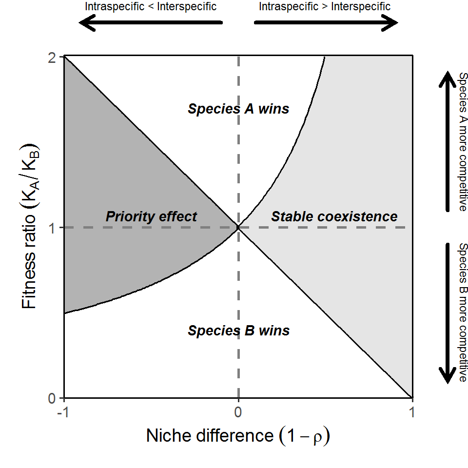
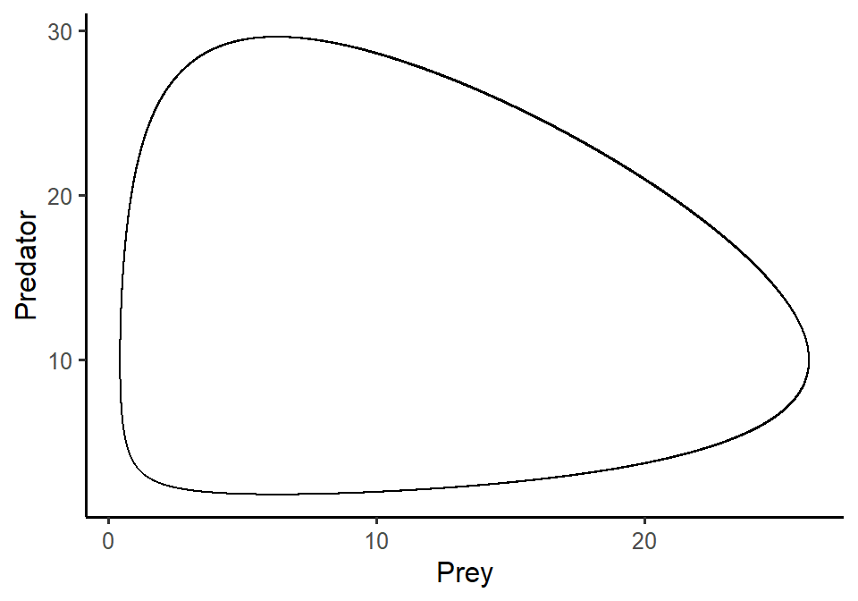

# Week 10 {-} 
<div style = "font-size: 28pt"> **_Modern coexistence theory & Lotka-Volterra model of predator-prey interactions (1)_**</div>

## Lecture in a nutshell {-}

* **Topic:**
    1. 
    2. 
    3. 
    
<div style="height:1px ;"><br></div>

* **Topic:**
    1. 
    2. 
    3.

<div style="height:1px ;"><br></div>    
<br>


## Lab demonstration {-}

In this lab, we are going to analyze the basic Lotka-Volterra predator-prey model:

<div style="margin-left: 30%;">$\begin{align}\frac {dN}{dt} = rN-aNP\end{align}\\$</div>
<div style="margin-left: 30%; margin-bottom: 5px;">$\begin{align}\frac {dP}{dt} = eaNP-dP\end{align}$</div>

Please simulate the model using the parameter set (_N_ = 10, _P_ = 2, _r_ = 1.0, _a_ = 0.1, _e_ = 0.8, _d_ = 0.5) and plot the population trajectories of predator and prey over time. Also show their population dynamics in the state-space diagram.

What will happen if you add a perturbation to the system (i.e., change the initial conditions)? Try out different values of _N_ and _P_ and visualize the differences in the state-space diagram.


```r
library(tidyverse)
library(deSolve)

### Model specification
LV_predation_model <- function(times, state, parms) {
  with(as.list(c(state, parms)), {
    dN_dt = r*N - a*N*P
    dP_dt = e*a*N*P - d*P
    return(list(c(dN_dt, dP_dt)))  
  })
}

### Model parameters
times <- seq(0, 100, by = 0.1)
state <- c(N = 10, P = 2)
parms <- c(r = 1.0, a = 0.1, e = 0.8, d = 0.5)

### Model application
pop_size <- ode(func = LV_predation_model, times = times, y = state, parms = parms)

### Visualize the population dynamics
# (1) population trajectories
pop_size %>%
  as.data.frame() %>%
  pivot_longer(cols = -time, names_to = "species", values_to = "N") %>%
  ggplot(aes(x = time, y = N, color = species)) + 
  geom_line(size = 1.5) +
  theme_classic(base_size = 12) +
  labs(x = "Time", y = "Population size") +
  scale_x_continuous(limits = c(0, 100.5), expand = c(0, 0)) +
  scale_y_continuous(limits = c(0, max(pop_size[, -1])*1.2), expand = c(0, 0)) +
  scale_color_brewer(name = NULL, palette = "Set1", labels = c("Prey", "Predator"))
```



```r
# (2) state-space diagram
pop_size %>%
  as.data.frame() %>%
  ggplot(aes(x = N, y = P)) + 
  geom_path() + 
  theme_classic(base_size = 12) +
  labs(x = "Prey", y = "Predator")
```


<br>

<style>
iframe {border: 0;}
</style>

Here is a shiny app for the Lotka-Volterra predator-prey model. Feel free to play around with different parameter inputs and see how the system dynamics change accordingly.

<iframe src="https://genchanghsu0115.shinyapps.io/LV_predation_mod_shinyapp/?showcase=0" width="800px" height="700px" data-external="1"></iframe>

## Additional readings {-}

[Signs of stabilisation and stable coexistence](./Additional readings/Broekman_et_al_2019_Eco_Let.pdf){target="_blank"}
<br>

## Assignments {-}

[Lotka-Volterra Predator-Prey Model with Logistic Prey Growth](./Assignments/Week10_LV Predation Model.pdf){target="_blank"}

<!-- [Suggested Solutions](./Assignments/Week10_LV Predation Model_with_Solutions.pdf){target="_blank"} -->
