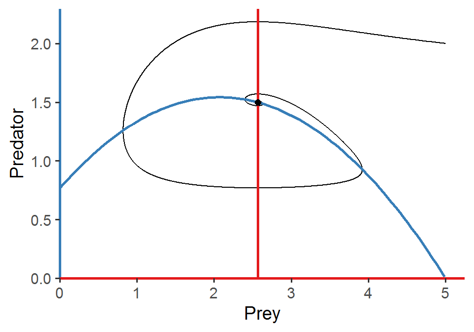
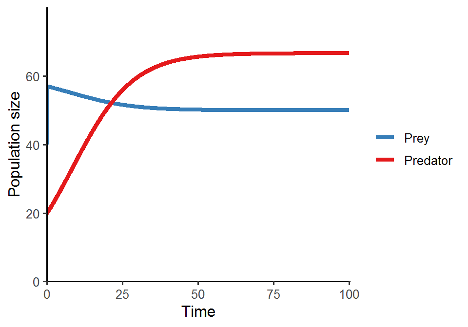

# Week 11 {-} 
<div style = "font-size: 28pt"> **_Lotka-Volterra model of predator-prey interactions (2)_**</div>

## Lecture in a nutshell {-}

* **Topic:**
    1. 
    2. 
    3. 
    
<div style="height:1px ;"><br></div>

* **Topic:**
    1. 
    2. 
    3.

<div style="height:1px ;"><br></div>    
<br>


## Lab demonstration {-}

Similar to what we've done in the previous class, in this lab we are going to analyze the Rosenzweig–MacArthur predator–prey model:

<div style="margin-left: 30%;">$\begin{align}\frac {dN}{dt} = rN(1-\frac{N}{K})-a\frac{N}{h+N}P\end{align}\\$</div>
<div style="margin-left: 30%; margin-bottom: 10px;">$\begin{align}\frac {dP}{dt} = ea\frac{N}{h+N}P-dP\end{align}$</div>

Please simulate the model using the parameter set (_N_ = 5, _P_ = 2, _r_ = 1.0, _K_ = 5.0, _a_ = 1.3, _h_ = 0.9, _e_ = 0.6, _d_ = 0.5) and plot the population trajectories of predator and prey as well as show their population dynamics in the state-space diagram.

What will happen if you add a perturbation to the system (i.e., change the initial conditions)? Try out different values of _N_ and _P_ and visualize the differences in the state-space diagram. Also compare the results of the Rosenzweig–MacArthur model and the original Lotka-Volterra model. What do you find regarding the final equilibrium cycles?


```r
library(tidyverse)
library(deSolve)

### Model specification
RM_predation_model <- function(times, state, parms) {
  with(as.list(c(state, parms)), {
    dN_dt = r*N*(1-(N/K))-(a*N/(1+a*h*N))*P
    dP_dt = e*(a*N/(1+a*h*N))*P-d*P
    return(list(c(dN_dt, dP_dt)))  
  })
}

### Model parameters
times <- seq(0, 200, by = 0.01)  
state <- c(N = 5, P = 2)  
parms <- c(r = 1.0, K = 5.0, a = 1.3, h = 0.9, e = 0.6, d = 0.5) 

### Model application
pop_size <- ode(func = RM_predation_model, times = times, y = state, parms = parms)

### Visualize the population dynamics
# (1) population trajectories
pop_size %>%
  as.data.frame() %>%
  pivot_longer(cols = -time, names_to = "species", values_to = "N") %>%
  ggplot(aes(x = time, y = N, color = species)) + 
  geom_line(size = 1.5) +
  theme_classic(base_size = 12) +
  labs(x = "Time", y = "Population size") +
  scale_x_continuous(limits = c(0, 200.5), expand = c(0, 0)) +
  scale_y_continuous(limits = c(0, max(pop_size[, -1])*1.2), expand = c(0, 0)) +
  scale_color_brewer(name = NULL, palette = "Set1", labels = c("Prey", "Predator"))
```


```r
# (2) state-space diagram
pop_size %>%
  as.data.frame() %>%
  ggplot(aes(x = N, y = P)) + 
  geom_path() + 
  geom_vline(xintercept = with(as.list(parms), d/(e*a-a*d*h)), color = "#377EB8", size = 1) +
  geom_function(data = data.frame(x = seq(0, 5, 0.01)), aes(x = x), fun = function(n){with(as.list(parms), r*(1+a*h*n)*(1-n/K)/a)}, inherit.aes = F, color = "#E41A1C", size = 1) + 
  geom_point(aes(x = tail(N, 1), y = tail(P, 1)), size = 2) +
  theme_classic(base_size = 14) +
  theme(axis.line.x = element_line(color = "#377EB8", size = 1),
        axis.line.y = element_line(color = "#E41A1C", size = 1)) + 
  labs(x = "Prey", y = "Predator") + 
  scale_x_continuous(limits = c(0, max(pop_size[, "N"]*1.05)), expand = c(0, 0)) + 
  scale_y_continuous(limits = c(0, max(pop_size[, "P"]*1.05)), expand = c(0, 0)) 
```


<br>

<style>
iframe {border: 0;}
</style>

Here is a shiny app for the Rosenzweig–MacArthur predator–prey model. Feel free to play around with different parameter inputs and see how the system dynamics change accordingly.

<iframe src="https://genchanghsu0115.shinyapps.io/RM_predation_mod_shinyapp/?showcase=0" width="800px" height="700px" data-external="1"></iframe>

### Special topic: time-scale separation {-}

Time-scale separation is a useful technique to reduce the dimension of the model system, where some state variables are assumed to operate at a much shorter time scale (i.e., fast variables) compared with the others (i.e., slow variables). The fast variables will adjust rapidly to their new equilibria in response to a slight change in the slow variables, such that the slow variables can be viewed as "constants" from the perspective of fast variables.

Here, we are going to use the Lotka-Volterra model with logistic prey growth to demonstrate time-scale separation: 

<div style="margin-left: 30%;">$\begin{align}\frac {dN}{dt} = rN(1-\frac{N}{K})-aNP\end{align}\\$</div>
<div style="margin-left: 30%; margin-bottom: 10px;">$\begin{align}\frac {dP}{dt} = eaNP-dP\end{align}$</div>

We will treat prey as a fast variable and predator as a slow variable. First, we find the equilibrium of prey: 

<div style="margin-left: 30%;">$\begin{align}N^{*} = K(1-\frac{ap}{r}) \end{align}$</div>

And then we plug $N^{*}$ into predator growth:

<div style="margin-left: 30%; margin-bottom: 10px;">$\begin{align}\frac {dP}{dt} = (eaK-d)P(1-\frac{eaK(\frac{a}{r})}{eaK-d}P)\end{align}$</div>

What do you see in the above equation? It is actually a logistic growth model! So under time-scale separation, predator will exhibit logistic population growth. We will show this shortly in the code below.

One simple way to achieve time-scale separation in this model is to increase the prey growth rate so that prey will grow much faster than predator, mimicking the shorter generation time of prey relative to that of predator.


```r
Prey_logistic_model <- function(times, state, parms) {
  with(as.list(c(state, parms)), {
    dN_dt = r*N*(1-(N/K))-a*N*P
    dP_dt = e*a*N*P-d*P
    return(list(c(dN_dt, dP_dt)))  
  })
}

times <- seq(0, 100, by = 0.01)  
state <- c(N = 40, P = 20)  
parms <- c(r = 40.0, K = 60, a = 0.1, e = 0.1, d = 0.5)  # r is chosen to be sufficiently large for time-scale separation

pop_size <- ode(func = Prey_logistic_model, times = times, y = state, parms = parms)

# population trajectories
pop_size %>%
  as.data.frame() %>%
  pivot_longer(cols = -time, names_to = "species", values_to = "N") %>%
  ggplot(aes(x = time, y = N, color = species)) + 
  geom_line(size = 1.5) +
  theme_classic(base_size = 12) +
  labs(x = "Time", y = "Population size") +
  scale_x_continuous(limits = c(0, 100.5), expand = c(0, 0)) +
  scale_y_continuous(limits = c(0, max(pop_size[, -1])*1.2), expand = c(0, 0)) +
  scale_color_brewer(name = NULL, palette = "Set1", labels = c("Prey", "Predator"))
```



```r
# state-space diagram
pop_size %>%
  as.data.frame() %>%
  ggplot(aes(x = N, y = P)) + 
  geom_point(color = "grey60", size = 3, shape = 21) + 
  geom_vline(xintercept = with(as.list(parms), d/(e*a)), color = "#377EB8", size = 1) +
  geom_abline(slope = with(as.list(parms), -r/(a*K)), 
              intercept = with(as.list(parms), r/a),
              color = "#E41A1C", size = 1) + 
  geom_point(aes(x = tail(N, 1), y = tail(P, 1)), size = 2) +
  theme_classic(base_size = 14) +
  theme(axis.line.x = element_line(color = "#377EB8", size = 1),
        axis.line.y = element_line(color = "#E41A1C", size = 1)) +            labs(x = "Prey", y = "Predator") + 
  scale_y_continuous(limits = c(NA, 100))
```


If we solve for the new predator growth equation derived under time-scale separation using the same parameter set and visualize the population trajectory, we will get almost exactly the same predator growth pattern as that in the original model.


```r
Time_scale_logistic <- function(times, state, parms) {
  with(as.list(c(state, parms)), {
    dP_dt = (e*a*K-d)*P*(1-((e*a*K*(a/r))/(e*a*K-d))*P)
    return(list(c(dP_dt)))  
  })
}

times_timescale <- seq(0, 100, by = 0.01)  
state_timescale <- c(P = 20)  
parms_timescale <- c(r = 40.0, K = 60, a = 0.1, e = 0.1, d = 0.5)  # r is chosen to be sufficiently large for time-scale separation

pop_size_timescale <- ode(func = Time_scale_logistic, times = times_timescale, y = state_timescale, parms = parms_timescale)

# plot the two predator population trajectories in the same figure
pop_size_timescale %>%
  as.data.frame() %>%
  mutate(P_original = pop_size[, "P"]) %>%
  rename(P_timescale = P) %>%
  pivot_longer(cols = -time, names_to = "model", values_to = "n") %>%
  ggplot(aes(x = time, y = n, color = model)) + 
  geom_line(size = 1.5, alpha = 0.8) +
  theme_classic(base_size = 14) +
  labs(x = "Time", y = "Population size") +
  scale_x_continuous(limits = c(0, 100.5), expand = c(0, 0)) +
  scale_y_continuous(limits = c(0, max(pop_size[, -1])*1.2), expand = c(0, 0)) +
  scale_color_brewer(name = NULL, palette = "Set1", labels = c("Original", "Time-scale"))
```


<br>

When you gradually shift _r_ from small to large values, you can see that the population dynamics of predator and prey change quite dramatically. Some interesting patterns will arise!

<iframe src="https://genchanghsu0115.shinyapps.io/Time_scale_sep_shinyapp/?showcase=0" width="800px" height="700px" data-external="1"></iframe>

## Additional readings {-}

<br>
<br>
<br>
<br>
<br>

## Assignments {-}

No assignments this week.


