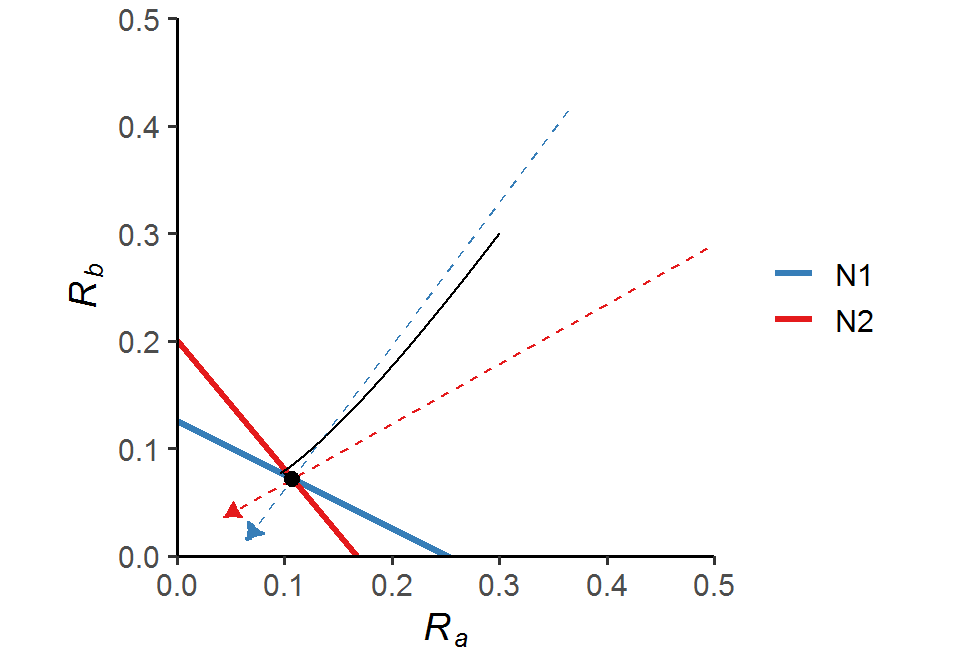

# Week 12 {-} 
<div style = "font-size: 28pt"> **_Resource competition: R* models_**</div>

## Lecture in a nutshell {-}

* **Topic:**
    1. 
    2. 
    3. 
    
<div style="height:1px ;"><br></div>

* **Topic:**
    1. 
    2. 
    3.

<div style="height:1px ;"><br></div>    
<br>


## Lab demonstration {-}

### Part 1 - R* rule {-}
In this part of the lab section, we are going to analyze the consumer-resource dynamics with two consumers and one resource:

<div style="margin-left: 30%;">$\begin{align}\frac {dN_{1}}{dt} = ea_{1}RN_{1}-dN_{1}\end{align}\\$</div>
<div style="margin-left: 30%;">$\begin{align}\frac {dN_{2}}{dt} = ea_{2}RN_{2}-dN_{2}\end{align}\\$</div>
<div style="margin-left: 30%; margin-bottom: 15px;">$\begin{align}\frac {dR}{dt} = d(S_{0}-R)-a_{1}RN_{1}-a_{2}RN_{2}\end{align}$</div>

Please simulate the model using the parameter set (_N1_ = 2, _N2_ = 2, _R_ = 0.1, _a1_ = 0.4, _a2_ = 0.6, _e_ = 1, _d_ = 0.01, _S~0~_ = 0.1) and visualize the population trajectories of the two consumers as well as the resource. 

Below is a plot of resource level vs. consumers' per capita growth rate. What would you predict about the system dynamics? 


```r
library(tidyverse)
library(deSolve)

### Parameters
a1 <- 0.4 
a2 <- 0.6
e <- 1
d <- 0.01 
S0 <- 0.1

### Resource level vs. consumers' per capita population growth
data.frame(R = seq(0, 0.1, 0.001)) %>%
  mutate(N1 = e*a1*R-d,
         N2 = e*a2*R-d) %>%
  pivot_longer(-R, names_to = "species", values_to = "N") %>%
  ggplot(aes(x = R, y = N, color = species)) +
  geom_line(size = 1.2) + 
  geom_hline(yintercept = 0, linetype = "dashed") + 
  labs(x = "Resource level", y = "Per capita growth rate") +
  scale_x_continuous(limits = c(0, 0.11), expand = c(0, 0)) +
  scale_y_continuous(limits = c(NA, 0.05), expand = c(0, 0)) +
  scale_color_brewer(name = NULL, palette = "Set1") + 
  theme_classic(base_size = 14)
```


```r
### Model specification
CR_model_2C_1R <- function(times, state, parms){
  with(as.list(c(state, parms)), {
    dN1_dt = e*a1*R*N1 - d*N1
    dN2_dt = e*a2*R*N2 - d*N2
    dR_dt =  d*(S0-R) - a1*R*N1 - a2*R*N2
    return(list(c(dN1_dt, dN2_dt, dR_dt)))
  })
}

### Model parameters
times <- seq(0.1, 1000, by = 0.1)  
state <- c(N1 = 2, N2 = 2, R = 0.1)  
parms <- c(a1 = 0.4, a2 = 0.6, e = 1, d = 0.01, S0 = 0.1)  # R and S0 should be the same in the chemostat

### Model application
pop_size <- ode(func = CR_model_2C_1R, times = times, y = state, parms = parms)

### Visualize the population dynamics
pop_size %>%
  as.data.frame() %>%
  pivot_longer(cols = -time, names_to = "species", values_to = "N") %>%
  mutate(trophic = case_when(species %in% c("N1", "N2") ~ "Consumer",
                             TRUE ~ "Resource")) %>%
  ggplot(aes(x = time, y = N, color = species)) + 
  geom_line(size = 1.5) +
  facet_wrap(~ trophic, 
             ncol = 2, 
             scales = "free_y",
             strip.position = "left") +
  theme_classic(base_size = 14) +
  theme(strip.background = element_blank(),
        strip.placement = "outside",
        legend.position = "top",
        legend.title = element_blank(),
        plot.margin = margin(r = 5)) + 
  labs(x = "Time", y = NULL) +
  scale_x_continuous(limits = c(0, 1050), expand = c(0, 0)) +
  scale_y_continuous(limits = c(0, NA), expand = c(0, 0)) +
  scale_color_brewer(name = NULL, palette = "Set1")
```


<div style="height:15px ;"><br></div>

We can see that _N~1~_ goes extinct, as predicted by the R* rule; the remaining consumer _N~2~_ and the resource _R_ exhibit stable coexistence.

<br>

### Part 2 - Tilman’s resource ratio hypothesis {-}

Now we will extend the model in Part 1. into two consumers and two resources:

<div style="margin-left: 30%;">$\begin{align}\frac {dN_{1}}{dt} = ea_{1a}R_{a}N_{1}+ea_{1b}R_{b}N_{1}-dN_{1}\end{align}\\$</div>
<div style="margin-left: 30%;">$\begin{align}\frac {dN_{2}}{dt} = ea_{2a}R_{a}N_{2}+ea_{2b}R_{b}N_{2}-dN_{2}\end{align}\\$</div>
<div style="margin-left: 30%; margin-bottom: 15px;">$\begin{align}\frac {dR_{a}}{dt} = d(S_{0a}-R_{a})-a_{1a}R_{a}N_{1}-a_{2a}R_{a}N_{2}\end{align}$</div>
<div style="margin-left: 30%; margin-bottom: 15px;">$\begin{align}\frac {dR_{b}}{dt} = d(S_{0b}-R_{b})-a_{1b}R_{b}N_{1}-a_{2b}R_{b}N_{2}\end{align}$</div>

Here, the two consumers _N~1~_ and _N~2~_ compete for two substitutable resources _R~1~_ and _R~2~_. Under certain conditions, the two consumers are able to coexist:


```r
library(tidyverse)
library(deSolve)

### Model specification
CR_model_2C_2R <- function(time, state, parms){
  with(as.list(c(state, parms)), {
    dN1_dt = e*a1a*Ra*N1 + e*a1b*Rb*N1 - d*N1
    dN2_dt = e*a2a*Ra*N2 + e*a2b*Rb*N2 - d*N2
    dRa_dt = d*(S0_a-Ra) - (a1a*N1*Ra) - (a2a*N2*Ra) 
    dRb_dt = d*(S0_b-Rb) - (a1b*N1*Rb) - (a2b*N2*Rb)
    return(list(c(dN1_dt, dN2_dt, dRa_dt, dRb_dt)))
  })
}

### Model parameters
times <- seq(0.1, 2000, by = 0.01)
state <- c(N1 = 0.05, N2 = 0.05, Ra = 0.3, Rb = 0.3)
parms <- c(a1a = 0.4, a1b = 0.8, a2a = 0.6, a2b = 0.5, e = 1, d = 0.1, S0_a = 0.3, S0_b = 0.3)  # Ra/Rb and S0a/S0b should be the same in the chemostat

### Model application
pop_size <- ode(func = CR_model_2C_2R, times = times, y = state, parms = parms)

### Visualize the population dynamics
pop_size %>%
  as.data.frame() %>%
  pivot_longer(cols = -time, names_to = "species", values_to = "N") %>%
  mutate(trophic = case_when(species %in% c("N1", "N2") ~ "Consumer",
                             TRUE ~ "Resource")) %>%
  ggplot(aes(x = time, y = N, color = species)) + 
  geom_line(size = 1.5) +
  facet_wrap(~ trophic, 
             ncol = 2, 
             scales = "free_y",
             strip.position = "left") +
  theme_classic(base_size = 14) +
  theme(strip.background = element_blank(),
        strip.placement = "outside",
        legend.position = "top",
        legend.title = element_blank(),
        plot.margin = margin(r = 8)) + 
  labs(x = "Time", y = NULL) +
  scale_x_continuous(limits = c(0, 2050), expand = c(0, 0)) +
  scale_y_continuous(limits = c(0, NA), expand = c(0, 0)) +
  scale_color_brewer(name = NULL, palette = "Set1")
```


<br>

The phase diagram also illustrates stable coexistence of the two consumers: 

```r
### Parameters
a1a <- 0.4
a1b <- 0.8
a2a <- 0.6
a2b <- 0.5
e <- 1 
d <- 0.1 
S0_a <- 0.3
S0_b <- 0.3

### Slopes and intercepts of the ZNGI's
ZNGI_slope_N1 <- -a1a/a1b
ZNGI_intercept_N1 <- d/(e*a1b)  
ZNGI_slope_N2 <- -a2a/a2b
ZNGI_intercept_N2 <- d/(e*a2b)

### Consumption vectors
eqilibrium_Ra <- (d/e)*((a1b-a2b)/(a2a*a1b-a2b*a1a))
eqilibrium_Rb <- (d/e)*((a1a-a2a)/(a2b*a1a-a2a*a1b))

convec_df <- data.frame(x = c(eqilibrium_Ra + 6*a1a*eqilibrium_Ra, 
                              eqilibrium_Ra + 6*a2a*eqilibrium_Ra),
                        y = c(eqilibrium_Rb + 6*a1b*eqilibrium_Rb, 
                              eqilibrium_Rb + 6*a2b*eqilibrium_Rb),
                        xend = c(eqilibrium_Ra - a1a*eqilibrium_Ra, 
                              eqilibrium_Ra - a2a*eqilibrium_Ra),
                        yend = c(eqilibrium_Rb - a1b*eqilibrium_Rb, 
                              eqilibrium_Rb - a2b*eqilibrium_Rb),
                        species = c("N1", "N2"))

### Phase diagram
ggplot() + 
  geom_abline(slope = ZNGI_slope_N1, intercept = ZNGI_intercept_N1, color = "#E41A1C", size = 1.2) + 
  geom_abline(slope = ZNGI_slope_N2, intercept = ZNGI_intercept_N2, color = "#377EB8", size = 1.2) + 
  geom_segment(data = convec_df, aes(x = x, y = y, xend = xend, yend = yend, color = species), linetype = "blank") + 
  geom_segment(data = convec_df, aes(x = x, y = y, xend = xend, yend = yend, color = species), size = 0.5, linetype = "dashed", arrow = arrow(type = "closed", length = unit(0.1, "inches")), show.legend = F) +
  geom_path(data = as.data.frame(pop_size), aes(x = Ra, y = Rb)) +
  geom_point(data = as.data.frame(pop_size), aes(x = last(Ra), y = last(Rb)), size = 2.5) +
  theme_classic(base_size = 14) +
  labs(x = expression(italic(R[a])), y = expression(italic(R[b]))) +
  scale_x_continuous(limits = c(0, 0.5), expand = c(0, 0)) +
  scale_y_continuous(limits = c(0, 0.5), expand = c(0, 0)) +
  scale_color_brewer(name = NULL, palette = "Set1", 
                     guide = guide_legend(override.aes = list(
                       linetype = "solid", size = 1.2))) +
  coord_fixed(ratio = 1)
```



In this particular case, if the initial resource levels _R~a0~_ and _R~b0~_ fall within the upper area bounded by the two consumption vectors, then the two species will coexist.

<br>

### Part 3 - Relative nonlinearity {-}

We have seen in Part 1. that two species cannot coexist on one resource if the consumers consume it in a linear fashion. What if the consumers consume the resource in a non-linear fashion? Could that generate stable coexistence?

In this part of the lab section, we will introduce non-linear (type II) functional response into the consumer-resource model in Part 1. for one of the consumers. We also change the resource equation to logistic growth and allow the two consumers to have different conversion efficiencies and mortality rates:

<div style="margin-left: 30%;">$\begin{align}\frac {dN_{1}}{dt} = e_{1}a_{1}RN_{1}-d_{1}N_{1}\end{align}\\$</div>
<div style="margin-left: 30%;">$\begin{align}\frac {dN_{2}}{dt} = e_{2}\frac{a_{2}R}{k_{2}+R}N_{2}-d_{2}N_{2}\end{align}\\$</div>
<div style="margin-left: 30%; margin-bottom: 15px;">$\begin{align}\frac {dR}{dt} = rR(1-\frac{R}{K_{R}})-a_{1}RN_{1}-\frac{a_{2}R}{k_{2}+R}N_{2}\end{align}$</div>

<div style="height:15px ;"><br></div>


```r
library(tidyverse)
library(deSolve)

### Model specification
CR_model_nonlinear <- function(times, state, parms){
  with(as.list(c(state, parms)), {
         dN1_dt = e1*a1*R*N1 - d1*N1
         dN2_dt = e2*(a2*R/(k2+R))*N2 - d2*N2
         dR_dt =  r*R*(1-(R/KR)) - a1*R*N1 - ((a2*R)/(k2+R))*N2
         return(list(c(dN1_dt, dN2_dt, dR_dt)))
       })
}

### Model parameters
times <- seq(0, 5000, by = 0.1)  
state <- c(N1 = 0.3, N2 = 19, R = 106) 
parms <- c(a1 = 0.003, a2 = 0.5, k2 = 50, e1 = 0.33, e2 = 0.3, d1 = 0.11, d2 = 0.1, r = 0.1, KR = 300)

### Model application
pop_size <- ode(func = CR_model_nonlinear, times = times, y = state, parms = parms)

pop_size %>%
  as.data.frame() %>%
  pivot_longer(cols = -time, names_to = "species", values_to = "N") %>%
  mutate(trophic = case_when(species %in% c("N1", "N2") ~ "Consumer",
                             TRUE ~ "Resource")) %>%
  ggplot(aes(x = time, y = N, color = species)) + 
  geom_line(size = 1.5) +
  facet_wrap(~ trophic, 
             ncol = 2, 
             scales = "free_y",
             strip.position = "left") +
  theme_classic(base_size = 14) +
  theme(strip.background = element_blank(),
        strip.placement = "outside",
        legend.position = "top",
        legend.title = element_blank(),
        plot.margin = margin(r = 5)) + 
  labs(x = "Time", y = NULL) +
  scale_x_continuous(limits = c(0, 5050), expand = c(0, 0)) +
  scale_y_continuous(limits = c(0, NA), expand = c(0, 0)) +
  scale_color_brewer(name = NULL, palette = "Set1")
```


<div style="height:15px ;"><br></div>

As shown in the figure, the two consumers coexist and exhibit stable limit cycles with the resource. In fact, the properties of nonlinearity are critical for the coexistence of _n_ species on _k_ < _n_ resources in certain parameter spaces.

<br>

## Additional readings {-}

[Competitive Exclusion](./Additional readings/Armstrong_&_McGehee_1980_AmNat.pdf){target="_blank"}

[A Graphical-Mechanistic Approach to Competition and Predation](./Additional readings/Tilman_1980_AmNat.pdf){target="_blank"}

[Trade-Offs and Coexistence in Consumer-Resource Models: It all Depends on what and where you Eat](./Additional readings/Vincent_et_al_1996_AmNat.pdf){target="_blank"}

<br>

## Assignments {-}

[Apparent Competition and P* Rule](./Assignments/Week12_Apparent Competition.pdf){target="_blank"}

<!-- [Suggested Solutions](./Assignments/Week12_Apparent Competition_with_Solutions.pdf){target="_blank"} -->

