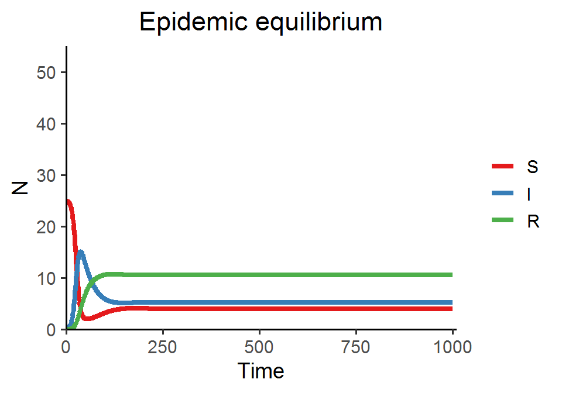
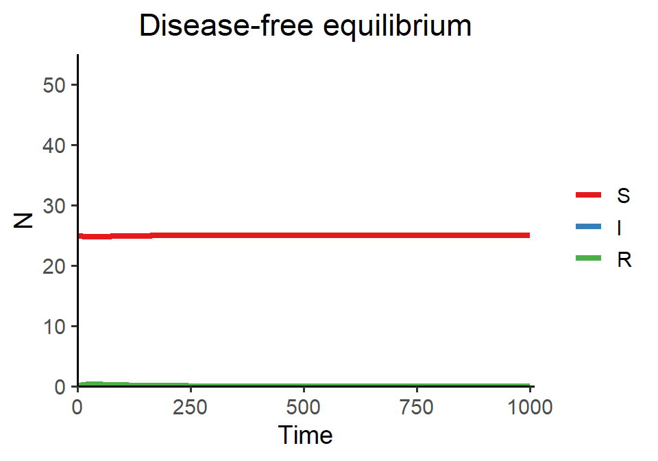

# Week 14 {-} 
<div style = "font-size: 28pt"> **_Disease dynamics and SIR models_**</div>

## Lecture in a nutshell {-}

* **Topic:**
    1. 
    2. 
    3. 
    
<div style="height:1px ;"><br></div>

* **Topic:**
    1. 
    2. 
    3.

<div style="height:1px ;"><br></div>    
<br>


## Lab demonstration {-}

In today's lab, we are going to simulate the SIR model with demography and visualize two types of disease dynamics: (1) the endemic equilibrium, at which the S, I, and R all coexist, and (2) the disease-free equilibrium, at which the disease will die off and only S remains.

<div style="margin-left: 35%;">$\begin{align}\frac {dS}{dt} = \theta-\beta SI-\delta S\end{align}\\$</div>
<div style="margin-left: 35%;">$\begin{align}\frac {dI}{dt} = \beta SI-\rho I-\gamma I\end{align}\\$</div>
<div style="margin-left: 35%; margin-bottom: 15px;">$\begin{align}\frac {dR}{dt} = \rho I-\delta R\end{align}$</div>


```r
library(tidyverse)
library(deSolve)

SIR_model_fun <- function(theta, beta, delta, rho, gamma, title){
  
  # model specification
  SIR_model <- function(times, state, parms) {
    with(as.list(c(state, parms)), {
      dS_dt = theta - beta*S*I - delta*S
      dI_dt = beta*S*I - rho*I - gamma*I 
      dR_dt = rho*I - delta*R
      return(list(c(dS_dt, dI_dt, dR_dt)))
    })
  }
  
  # model parameters
  times <- seq(0, 1000, by = 1)
  state <- c(S = 25, I = 0.1, R = 0)
  parms <- c(theta = theta, beta = beta, delta = delta, rho = rho, gamma = gamma)
  
  # model application
  SIR_out <- ode(func = SIR_model, times = times, y = state, parms = parms)
  
  # visualization
  SIR_out %>%
    as.data.frame() %>%
    pivot_longer(cols = -time, names_to = "state", values_to = "N") %>%
    mutate(state = fct_relevel(state, "S", "I", "R")) %>%
    ggplot(aes(x = time, y = N, color = state)) + 
    geom_line(size = 1.5) +
    theme_classic(base_size = 14) +
    labs(x = "Time", y = "N", title = title) +
    scale_x_continuous(limits = c(0, 1010), expand = c(0, 0)) +
    scale_y_continuous(limits = c(0, 55), expand = c(0, 0)) +
    scale_color_brewer(name = NULL, palette = "Set1") + 
    theme(plot.title = element_text(hjust = 0.5))
  
}
```


```r
### Epidemic equilibrium  
SIR_model_fun(theta = 0.25, beta = 0.01, delta = 0.01, rho = 0.02, gamma = 0.02, title = "Epidemic equilibrium")
```



```r
### Disease-free equilibrium
SIR_model_fun(theta = 0.25, beta = 0.01, delta = 0.01, rho = 0.3, gamma = 0.02, title = "Disease-free equilibrium")
```



By increasing the recovery rate $\rho$ in the second example, we drive the basic reproduction number $R_{0}$ below 1, and thus the disease will not spread and the system reaches the disease-free equilibrium.

<br>

## Additional readings {-}

[Population biology of infectious diseases: Part I](./Additional readings/Anderson_&_May_1979_I_Nature.pdf){target="_blank"}

[Population biology of infectious diseases: Part II](./Additional readings/Anderson_&_May_1979_II_Nature.pdf){target="_blank"}

<br>

## Assignments {-}

No assignments this week.


