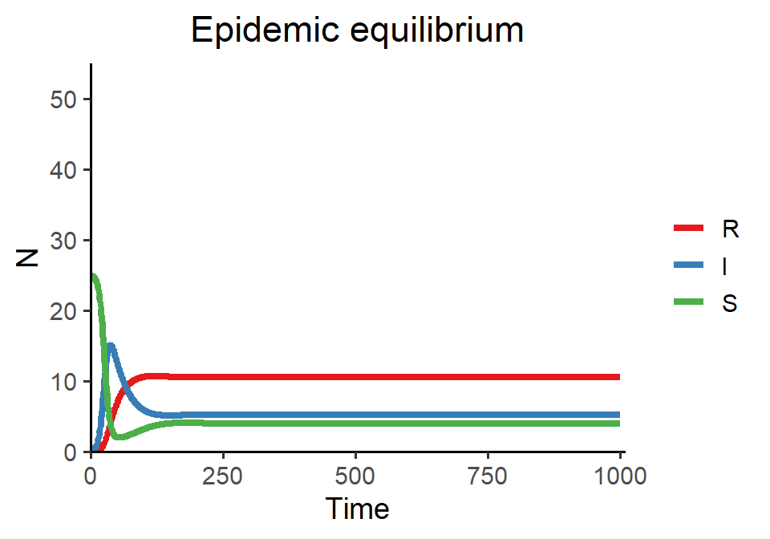

# Week 14 {-} 
<div style = "font-size: 28pt"> **_Disease dynamics and SIR models_**</div>

## Lecture in a nutshell {-}

* **Topic:**
    1. 
    2. 
    3. 
    
<div style="height:1px ;"><br></div>

* **Topic:**
    1. 
    2. 
    3.

<div style="height:1px ;"><br></div>    
<br>


## Lab demonstration {-}

In today's lab, we are going to simulate the SIR model with demography and visualize two types of disease dynamics: (1) the endemic equilibrium, in which the S, I, and R all coexist, and (2) the disease-free equilibrium, in which the disease eventually goes extinct and only S remains. 

<div style="margin-left: 30%;">$\begin{align}\frac {dS}{dt} = \lambda-\beta SI-dS\end{align}\\$</div>
<div style="margin-left: 30%;">$\begin{align}\frac {dI}{dt} = \beta SI-(d+\delta)I-\gamma I\end{align}\\$</div>
<div style="margin-left: 30%; margin-bottom: 15px;">$\begin{align}\frac {dR}{dt} = \gamma I-dR\end{align}$</div>


```r
library(tidyverse)
library(deSolve)

SIR_model_fun <- function(lambda, beta, d, delta, gamma, title){
  
  # model specification
  SIR_model <- function(times, state, parms) {
    with(as.list(c(state, parms)), {
      dS_dt = lambda - beta*S*I - d*S
      dI_dt = beta*S*I - (d+delta)*I - gamma*I 
      dR_dt = gamma*I - d*R
      return(list(c(dS_dt, dI_dt, dR_dt)))
    })
  }
  
  # model parameters
  times <- seq(0, 1000, by = 1)
  state <- c(S = 50, I = 2, R = 0)
  parms <- c(lambda = lambda, beta = beta, d = d, delta = delta, gamma = gamma)
  
  # model application
  SIR_out <- ode(func = SIR_model, times = times, y = state, parms = parms)
  
  # visualization
  SIR_out %>%
    as.data.frame() %>%
    pivot_longer(cols = -time, names_to = "state", values_to = "N") %>%
    ggplot(aes(x = time, y = N, color = fct_reorder(state, N, last, .desc = T))) + 
    geom_line(size = 1.5) +
    theme_classic(base_size = 14) +
    labs(x = "Time", y = "N", title = title) +
    scale_x_continuous(limits = c(0, 1010), expand = c(0, 0)) +
    scale_y_continuous(limits = c(0, 55), expand = c(0, 0)) +
    scale_color_brewer(name = NULL, palette = "Set1") + 
    theme(plot.title = element_text(hjust = 0.5))
  
}

### Epidemic equilibrium  
SIR_model_fun(lambda = 0.25, beta = 0.01, d = 0.01, delta = 0.01, gamma = 0.02, title = "Epidemic equilibrium")
```



```r
### Disease-free equilibrium
SIR_model_fun(lambda = 0.25, beta = 0.01, d = 0.01, delta = 0.01, gamma = 0.3, title = "Disease-free equilibrium")
```


In the second example, we increase the recovery rate $\gamma$, driving the basic reproduction number $R_{0}$ below 1. Thus, the disease will eventually go extinct and the system then enters disease-free equilibrium.  

<br>

## Additional readings {-}

No additional readings this week.

<br>

## Assignments {-}

No assignments this week.


