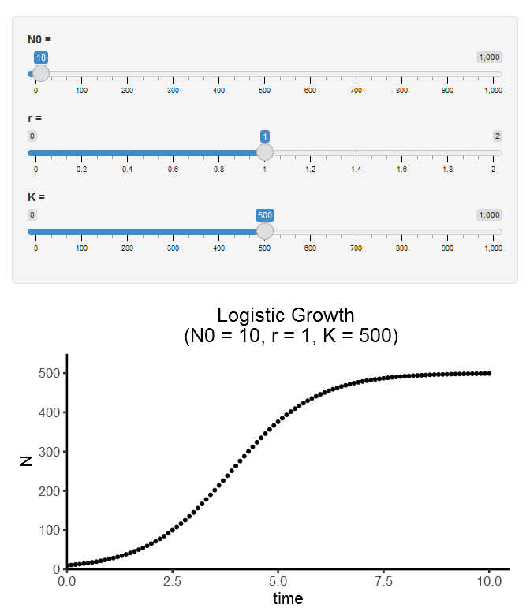

# Week 5 {-} 
<div style = "font-size: 28pt"> **_Density-dependence and logistic population growth_**</div>


```
## -- Attaching packages --------------------------------------- tidyverse 1.3.1 --
```

```
## v ggplot2 3.3.5     v purrr   0.3.4
## v tibble  3.1.2     v dplyr   1.0.7
## v tidyr   1.1.3     v stringr 1.4.0
## v readr   1.4.0     v forcats 0.5.1
```

```
## -- Conflicts ------------------------------------------ tidyverse_conflicts() --
## x dplyr::filter() masks stats::filter()
## x dplyr::lag()    masks stats::lag()
```

```
## 
## Listening on http://127.0.0.1:3656
```


